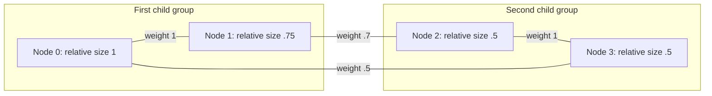

# Unequal-sized fold network and subgroup accounting

The optional multiscale experiment joins four passive synthetic modules with
relative lengths 1, .75, .5 and .5. Their geometry, mass, inertia, restoring
potential and damping use the explicit assumptions in `fold_scaling.md`.
Only node 0 starts displaced and moving; there is no active reservoir input.

## Connection rule

For an edge between absolute body scales a and b with positive weight w,
physical port stiffness is `w max(a,b) K0`, where `K0=diag(.3,.1) N/m`.
Each body's nonlinear port mapping uses its own length `.1 a` or `.1 b` metres.
Both generalized forces are derived from the same mismatch potential using
the respective port Jacobian.

The maximum-size rule is symmetric in the endpoints and homogeneous of degree
one. It recovers the verified larger-parent pair and preserves cubic potential
scaling when every length is multiplied by the same factor. It is one synthetic
constitutive choice; it is not a measured attachment law or uniquely required
by energy conservation. Sizes are fixed parameters, so this experiment does
not require differentiating the maximum with respect to changing body sizes.

The graph contains edges 0--1, 1--2, 2--3 and 3--0, with weights 1, .7, 1 and .5.
The hierarchy groups nodes [0,1] and [2,3] beneath the root. A graph loop is not
evidence of geometric folding closure or a physical fractal assembly.

This diagram shows accounting connections and membership, not physical placement.

## Accounts and checks

Each node tracks its mechanical energy, damping loss and incident connection
work. Each edge owns its potential once and records work at both endpoints.
An inclusive subgroup account contains its nodes and internal edge potentials;
its change equals work entering at its boundary. Parent and child accounts
overlap and must not be added together. The root counts the full system once.

Uniform global factors 1, .75 and .5 preserve relative sizes. Absolute body
scales remain inside [.25,1]. Comparisons use corresponding scaled time grids;
this tests similarity consistency. A separate smaller-timestep run tests
integration agreement. A reversed reaction on the second edge is deliberately
nonconservative and should fail that edge's account and the root total, while
other local accounts may remain valid.

The source-hashed reproduction report is `experiments/fold-multiscale-summary.json`.
It records initial states, graph weights, body sizes, group membership, sampled
states and energy accounts. The numerical results below refer only to this
bounded model and its declared time interval.

## Results

| Run | Physical duration (s) | Root balance error (J) |
| --- | ---: | ---: |
| Global scale 1 | 1 | 7.940e-17 |
| Global scale .75 | .75 | 3.350e-17 |
| Global scale .5 | .5 | 9.925e-18 |
| Incorrect reaction on edge 1 | 1 | 1.701e-10 |

The maximum baseline subgroup residual is 2.691e-16 J. In the faulty run,
edge 1 alone has the large balance defect; other edge errors remain below
3.81e-16 J. Both child groups still balance to within 2.314e-16 J because
the faulty edge crosses their boundary and they honestly record its work.
The connection and root checks expose the faulty law.

At global scale .75, coordinates agree exactly with the reference at matched
reference times, rescaled rates differ by at most 1.215e-17, and body energies
by at most 5.295e-22 J. The separate half-step check at global scale .5 reduces
root residual from 9.925e-18 to 1.053e-18 J; coordinate differences are below
1.944e-10 and rate differences below 7.749e-10 in their respective units.
Two timesteps show agreement, not a measured convergence order.

Validation includes 15 new network tests and 39 linked scaled-pair/hierarchy
tests, all passing. Independent edge-power differentiation gives 6.54e-15 W
error, with exact endpoint-reversal symmetry. Tests also check subgroup power,
node permutation and reduction to the previously verified pair.

`scripts/plot_fold_multiscale.py` plots saved report samples after checking all
source hashes. Reproduce with `--input docs/experiments/fold-multiscale-summary.json`
and `--output artifacts/fold-multiscale/computed-network.png` (matplotlib required).
The resulting plot was visually inspected. It shows computed energy transfer,
fold angles and ledger errors, not a replacement for spatial/XR validation.

## Remaining scope

This joins size-dependent bodies and connections in a small passive network.
It does not validate material properties, spatial placement, real attachments,
intermodule collision clearance, sustained breathing or the entire recursive
structure. Active reservoirs have not yet been assigned consistent size laws
in this network. That extension requires explicit scaling of capacity, transfer
power, damping and leakage timescales before claiming comparable active behavior.
