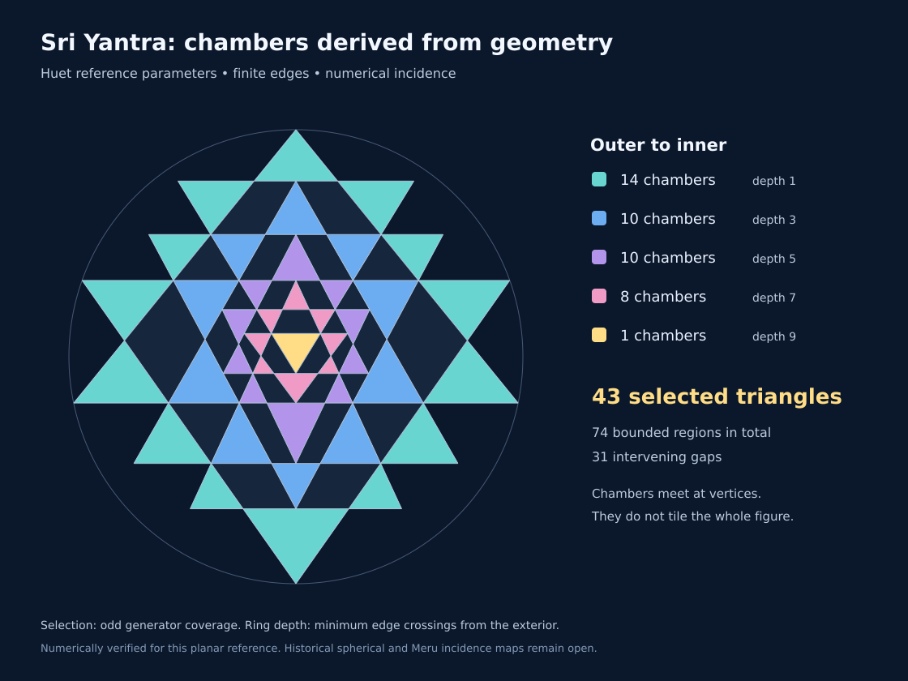

# Sri Yantra Chamber Extraction v0.1

**Status:** Numerically verified for the Huet planar reference.

## Result

The 27 finite generator edges now yield 43 selected triangular chambers in
outer-to-inner circuits of **14, 10, 10, 8, 1**. These counts are outputs of
`src/sri_yantra_chambers.py`; neither 43 nor the circuit sizes are inputs to
the extraction algorithm.



The geometric input is the existing Huet parameter reconstruction from
Chiodo's concurrency conditions. Chiodo, *On the construction of the Sri
Yantra*, C. R. Mathématique 359 (2021), DOI 10.5802/crmath.163, Figure 2b and
the accompanying enclosure discussion, supplies the traditional ring target.
The graph extraction and coverage/depth verification below are this
repository's numerical work, not an algorithm attributed to that paper.

## Extraction and selection

1. Normalize coordinates by the largest bounding-box side.
2. Intersect the finite segments, merge coincident vertices within tolerance,
   and split each segment into atomic graph edges.
3. Order incident edges by angle and walk the bounded faces and exterior.
4. Compute each face's minimum edge-crossing distance from the exterior using
   breadth-first search in the dual graph.
5. Independently classify its interior point against the nine original
   triangles. Retain faces covered by an odd number of generators.
6. Remove collinear points only from the geometric corner list, retaining all
   incidence vertices in the face boundary.
7. Group selected chambers by depth. Verify that each noncentral group forms
   a single connected degree-two cycle through shared vertices.

For this reference, generator coverage equals dual depth on every bounded
face. Every odd-depth face has exactly three geometric corners. The four
surrounding groups are actual contact circuits, not bins assigned by radius
or by stored counts. Each neighboring pair in a circuit shares one vertex.

## Measured topology

| Quantity | Computed result |
| --- | ---: |
| Intersection and endpoint vertices | 69 |
| Atomic edges | 142 |
| Bounded faces | 74 |
| Exterior faces | 1 |
| Euler check, V - E + F | 2 |
| Selected triangular chambers | 43 |
| Even-coverage intervening regions | 31 |
| Geometric triangles among all bounded faces | 53 |
| Geometric quadrilaterals among all bounded faces | 21 |
| Shared-vertex chamber pairs, including between rings | 91 |
| Shared-edge chamber pairs | 0 |

| Exterior depth / generator coverage | Selected chambers |
| --- | ---: |
| 1 | 14 |
| 3 | 10 |
| 5 | 10 |
| 7 | 8 |
| 9 | 1 |

Counting all polygons would give 74. Counting all geometric triangles would
give 53. Counting boundaries with exactly three graph vertices would give
40. None of these is the traditional chamber-selection rule. The 43 selected
triangles leave intervening regions, including ten other triangular regions.

## Validation

PR #67 also supplies `src/sri_yantra_huet_chambers.py`, an independent solver
that enumerates supported triangular circuits and applies the sourced ring
sizes as constraints. A direct coordinate comparison matches every selected
triangle in every ring between that solver and this coverage/depth method.
Thus the two constructions recover the same chambers, not just equal counts.
The coverage/depth extractor never receives the traditional ring sizes.

The tests check Euler's identity, circuit connectedness, single-vertex
contacts, absence of shared edges between chambers, reflection involution,
and agreement between independent coverage and graph depth. Summing the areas
of all faces inside each generator recovers each original triangle's area
to an absolute tolerance of 2e-12 in the normalized reference coordinates.

The graph is unchanged at relative tolerances 1e-11, 1e-9, and 1e-7. Rotating,
translating, scaling by 1e-5 through 1e5, and reversing input order preserve
the topology and normalized areas. Deliberately breaking concurrency changes
the output counts. Invalid, unresolved, and collinear duplicate geometry is
rejected.

An additional independent GEOS symmetric-difference calculation using the
original triangles agreed with the total selected area within 1.1e-11.
Its point-contact topology is grid-sensitive, so its polygon
component count is not used as a topology oracle. GEOS is not a runtime or
test dependency of the new module.

## Reproduce

```bash
python -m src.sri_yantra_chambers
python -m scripts.render_sri_yantra_chambers
python -m pytest -q tests/test_sri_yantra_chambers.py
```

`ChamberComplex` exposes vertices, atomic edges, bounded faces, the exterior
boundary, face adjacency, chamber contacts, and verified ring traversal.
Face adjacency uses index -1 for the exterior. Generator identifiers follow
the supplied input order, which is Chiodo t1 through t9 by default.

## Evidence boundary and next gate

This is a numerical extraction for one reference construction and its tested
transformations. It does not prove the topology throughout the entire
four-parameter family. The coordinates remain floating-point quantities.

The next gate is an explicit mapping from these computed chamber vertices,
edges, and contacts into the spherical and Meru candidates. Preserving only
43 labels is insufficient: the map must preserve incidences and avoid new
edge crossings or collisions. Physical interpretations remain hypotheses.
