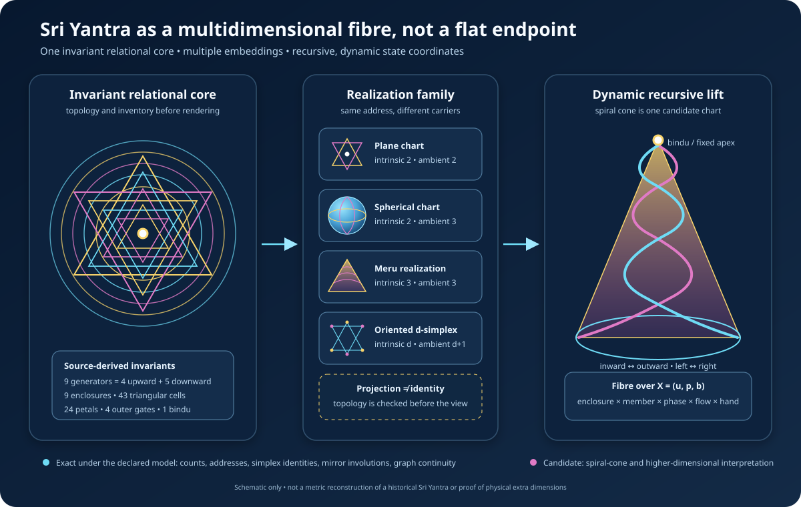

# Multidimensional Sri Yantra Contract v0.1

## Purpose

This checkpoint corrects an important modelling error: the visible planar Sri
Yantra is not treated as the whole engine object. It is one chart of an
embedding-independent relational complex.

The implementation separates four things that must not be collapsed:

1. the source-derived inventory of generators, enclosures, and components;
2. the intrinsic topology carried by that inventory;
3. a chosen plane, spherical, Meru, simplex, or spiral-cone realization;
4. the recursive-universe, named-plane, possibility, phase, flow, and
   handedness coordinates of an engine state.

This makes it possible to ask which relations survive a change of dimension
without declaring that a drawing is identical to a physical omniverse.



## Source-derived abstract inventory

The canonical inventory is recorded before any coordinates are assigned:

| Outer-to-inner enclosure | Counted component | Count |
| --- | --- | ---: |
| Bhupura | boundary gates | 4 |
| outer lotus | petals | 16 |
| inner lotus | petals | 8 |
| outer triangular circuit | triangular cells | 14 |
| next triangular circuit | triangular cells | 10 |
| next triangular circuit | triangular cells | 10 |
| inner triangular circuit | triangular cells | 8 |
| inner triangle | triangular cell | 1 |
| bindu | central component | 1 |

Thus the triangular region inventory is

$$
14+10+10+8+1=43.
$$

The generating family remains four upward and five downward triangles. The
bindu is represented separately from the 43 triangular cells. Likewise, the
four boundary gates, 24 lotus petals, nine generators, nine enclosures, and 43
cells are different counts with different semantics. The code does not turn
one into another through numerology.

The abstract signature is independent of every realization. A render may
change while the ordered enclosure inventory, generator orientations, and
local address remain unchanged.

## Not merely a two-dimensional object

The contract distinguishes **intrinsic dimension** from **ambient dimension**:

| Realization | Intrinsic dimension | Ambient coordinates | Status |
| --- | ---: | ---: | --- |
| plane | 2 | 2 | documented mathematical form |
| spherical | 2 | 3 | documented mathematical form |
| Meru | 3 | 3 | source-derived traditional form |
| oriented simplex field | arbitrary $d\geq2$ | $d+1$ barycentric coordinates | engine candidate |
| spiral cone | 3 | 3 | engine candidate tied to the book's scale map |

A spherical network is intrinsically a curved two-dimensional surface even
though it is embedded in three dimensions. A Meru is a three-dimensional
realization. The arbitrary-dimensional simplex and spiral-cone constructions
are new engine hypotheses, not claims about the historical form.

Projection is therefore a view operation, not an equality of dimensions. It
may lower ambient dimension while preserving the abstract address. A lift may
raise ambient dimension under the same rule. Neither operation changes which
recursive universe, named plane, possibility branch, enclosure, local member,
or phase is being represented.

## Fibre address over the current Omniverse candidate

The preceding subsystem established the base address

$$
X=(u,p,b),
$$

where $u$ is a recursive universe address, $p$ is a named plane, and $b$
is a possibility path. The Sri Yantra coordinate is attached over that base:

$$
Y=(X,a,m,\varphi;R,f,h).
$$

Here:

- $a$ is the ordered enclosure;
- $m$ is a cyclic local-member index within that enclosure;
- $\varphi\in\mathbb{Q}/\mathbb{Z}$ is an exact phase in turns;
- $R$ is the selected realization;
- $f\in\{-1,0,+1\}$ is inward, stationary, or outward flow;
- $h\in\{-1,+1\}$ is handedness.

The complete software state consequently exposes these independent factors:

```text
recursive universe × named plane × possibility path
× enclosure × local member × phase
× realization × flow × handedness
```

This is a product state space, not a claim that every factor is a physical
spacetime dimension. The scale and possibility factors are discrete trees,
the plane factor is an open graph, phase is circular, and the realization may
have a continuous geometric carrier.

## Triangle-to-simplex dimensional lift

The minimal dimension-open generalization replaces an oriented triangle by an
oriented regular $d$-simplex. In $d+1$ barycentric coordinates its vertices
are

$$
v_i=e_i-\frac{1}{d+1}\mathbf 1,
\qquad i=0,\ldots,d.
$$

They obey

$$
\sum_i v_i=0,
\qquad
\|v_i-v_j\|^2=2 \quad (i\ne j).
$$

The complementary orientation is exact central inversion:

$$
v_i^-=-v_i^+.
$$

This produces a sequence rather than a two-dimensional endpoint:

| Intrinsic dimension | Oriented generator | Two-orientation compound |
| ---: | --- | ---: |
| 2 | triangle | 6 vertices |
| 3 | tetrahedron | 8 vertices |
| 4 | 4-simplex | 10 vertices |
| $d$ | $d$-simplex | $2(d+1)$ vertices |

The three-dimensional row supplies a precise local bridge to the existing
stella-octangula work: two centrally inverted regular tetrahedra have eight
compound vertices. It does **not** prove that the complete nine-generator Sri
Yantra is identical to one star tetrahedron. The source four-plus-five
generator inventory is retained when all nine templates are lifted.

The present checkpoint deliberately leaves generator placement open. An
exact higher-dimensional construction must derive placement and intersection
conditions; it may not merely stack nine identical centered simplices.

## Spherical and Meru realization family

Mathematical literature treats both plane and spherical triangular networks,
including nontrivial intersection constraints and multiple spherical circuit
families. This supports modelling a family of valid configurations rather
than one privileged flat picture.

The implementation currently records the realization signatures and provides
a generic unit-hemisphere circuit chart for regression testing. That chart is
**not** presented as C. S. Rao's constrained spherical Sri Yantra construction.
An exact spherical metric and incidence reconstruction remain a separate gate.

Likewise, the Meru record recognizes that the tradition contains a
three-dimensional realization. This version does not guess its heights or
claim that every commercial or ritual Meru follows one unique metric.

## Spiral-cone and recursive expansion candidate

The book's spiral-cone scale expression is represented as a candidate chart,
not as a historical replacement for the Sri Meru. For enclosure depth
$d_a\in[0,1]$, local phase $\varphi$, handedness $h$, base radius $R$,
and height $H$, the chart uses

$$
r_a=R(1-d_a),
$$

$$
\theta=2\pi\left(\frac{m}{N_a}+h\varphi\right),
$$

$$
(x,y,z)=\left(r_a\cos\theta,r_a\sin\theta,Hd_a\right).
$$

The bhupura lies on the cone base and the bindu lies at its apex. Phase rotates
the noncentral components, and handedness reverses that rotation. Recursion is
not simulated by shrinking the drawing and calling it another universe. A
new recursive universe is created only by changing the separately typed base
address $u$; the full local Yantra fibre may then be attached to that child.

This gives a disciplined interpretation of “the whole exists within each
part”: each recursive base address can carry a complete local fibre, while its
scale identity remains explicit.

## Mirror operations

The word *mirror* now denotes several independent involutions:

1. the existing recursive-universe and signed-possibility mirror;
2. cyclic local reflection $m\mapsto-m\pmod{N_a}$;
3. phase reflection $\varphi\mapsto-\varphi\pmod1$;
4. flow reversal, inward $\leftrightarrow$ outward;
5. handedness reversal, left $\leftrightarrow$ right;
6. simplex orientation reversal, $v\mapsto-v$.

Each operation squares to the identity. They are not silently identified with
one another. In particular, geometric reflection need not reverse flow, and
flow reversal need not move a state to another universe or possibility.

The cyclic address mirror is equivariant in both candidate charts: it reflects
the azimuthal coordinate while retaining enclosure depth. The bindu remains
fixed.

## Conservative inward and outward shell flow

The nine enclosures form eight adjacent interfaces. A declared cut flux $I$
is placed on each interface of an inward route:

$$
a_1\rightarrow a_2\rightarrow\cdots\rightarrow a_9.
$$

With outgoing-minus-incoming graph divergence, every intermediate enclosure
has zero divergence. Only the outer boundary and bindu are endpoints. The
outward route is the exact reverse. Superposing equal inward and outward routes
gives

$$
\operatorname{div}J=0
$$

at all nine enclosures.

Component counts differ from shell to shell, so equal flux per component is
not imposed globally. The optional uniform distribution on enclosure $a$ is

$$
I_{a,m}=\frac{I}{N_a},
\qquad
\sum_{m=0}^{N_a-1}I_{a,m}=I.
$$

This preserves total cut flux without pretending that four gates, sixteen
petals, fourteen cells, and the bindu are interchangeable objects.

The flux is dimensionless. Calling it energy, information, Ether,
Consciousness, or a physical current would require a separately defined unit,
dynamics, coupling, and observation.

## Relationship to the existing geometry stack

| Existing subsystem | Role beside the Sri Yantra fibre |
| --- | --- |
| circle / Vesica | containment and interface geometry |
| Seed / Flower | center-plus-neighbour and overlap substrate |
| inner / outer Tree | graph routing and circulation |
| stella octangula | exact three-dimensional dual-tetrahedron compound |
| 16-cell / tesseract / 24-cell | controlled four-dimensional coordinate bridges |
| transitive planes | named overlap graph independent of scale |
| possibility branching | signed branch tree independent of plane and scale |
| Sri Yantra complex | ordered oriented-enclosure fibre and dimensional realization family |

The Sri Yantra does not replace the circular construction. The circles express
vessels and overlaps; the Yantra fibre expresses oriented generators, nested
enclosures, phase, and inward/outward traversal. A future coupling must state
an exact map between the two rather than relying on visual similarity.

## The 108 question

Traditional Sri Cakra descriptions include a count of 108 presiding Devis
across the nine enclosures. The engine independently has a canonical
108-state core. That is a meaningful comparison target, but this checkpoint
does not identify them.

An accepted bridge will require an explicit bijection

$$
f:\mathbb Z_{108}\longrightarrow D_{108}
$$

and must show what the canonical translations $T_9$, $T_{21}$, polarity
$T_{54}$, and reflection $F(n)=107-n$ become on the target set. Equal
cardinality alone is insufficient.

## Evidence boundary

| Statement | Status |
| --- | --- |
| The implemented canonical inventory has nine enclosures and nine generators | Exact software structure |
| Its triangular components total 43 as $14+10+10+8+1$ | Exact finite count under the inventory |
| The generator orientations total four upward and five downward | Source-derived inventory and exact software count |
| Plane, spherical, and Meru are kept as distinct realization types | Exact software separation informed by source forms |
| A regular $d$-simplex template has $d+1$ centered equidistant vertices | Exact geometry |
| Opposite simplex templates are related by central inversion | Exact geometry |
| Projection and lift preserve the fibre address | Exact software invariant |
| Equal inward and outward shell routes have zero graph divergence | Exact finite-graph identity |
| The spherical circuit chart reproduces a historical spherical Sri Yantra | Not established |
| The spiral-cone chart is the unique correct dimensional expansion | Not established |
| The 108 traditional associations equal the canonical 108 processor states | Not established |
| The model describes physical extra dimensions or an actual omniverse | Not established |

## Failure conditions

The implementation fails closed when:

- enclosure ordinals or generator-family indices skip a position;
- identifiers or generators repeat;
- a local member lies outside its enclosure's own count;
- intrinsic dimension exceeds ambient dimension;
- a named realization uses the wrong dimension or curvature signature;
- a projection raises ambient dimension or a lift lowers it;
- a shell edge skips an enclosure;
- shell flux is negative or nonfinite;
- a stationary route carries nonzero flux;
- phase is not an exact integer or rational turn;
- handedness is not $-1$ or $+1$;
- a supplied lifted generator differs from the canonical simplex template.

## Verification

Focused tests cover:

- the 4/5 generator, nine-enclosure, 43-cell, 24-petal, four-gate, and bindu
  inventories;
- exact separation of intrinsic and ambient dimension;
- dimension-open simplex lifts through dimensions 2, 3, 4, 7, and 13;
- centered-simplex regularity and central inversion;
- independent base address, enclosure, phase, realization, flow, and
  handedness factors;
- mirror, flow-reversal, and handedness involutions and their commutation;
- constant-cut-flux inward and outward routes;
- zero-divergence closed shell circulation;
- flux normalization across unequal component counts;
- spiral-cone and spherical-chart mirror equivariance;
- invalid address, realization, dimension, route, and scalar inputs.

Implementation:

- `src/sri_yantra_multidimensional.py`
- `tests/test_sri_yantra_multidimensional.py`

## Research sources

- C. S. Rao, [“Sriyantra — A Study of Spherical and Plane Forms”](https://insa.ndl.gov.in/items/04e2975a-5369-48e9-b47f-d37bcddbadc3/full), *Indian Journal of History of Science* 33(3), 1998, 203–227.
- A. P. Kulaichev, [“Sriyantra and Its Mathematical Properties”](https://insa.nic.in/writereaddata/UpLoadedFiles/IJHS/Vol19_3_7_APKulaichev.pdf), *Indian Journal of History of Science* 19(3), 1984, 279–292.
- Gérard Huet, [“Śrī Yantra Geometry”](https://gallium.inria.fr/~huet/PUBLIC/Nivat.pdf), *Theoretical Computer Science* 281, 2002, 609–628.
- Andrea Chiodo, [“On the Construction of the Śrī Yantra”](https://doi.org/10.5802/crmath.163), *Comptes Rendus. Mathématique* 359(1), 2021, 1–10.
- Subhash Kak, [“The Great Goddess Lalitā and the Śrī Cakra”](https://ikashmir.net/subhashkak/docs/SriChakra.pdf), *Brahmavidyā: The Adyar Library Bulletin* 72–73, 2008–2009.

The mathematical papers support construction and form claims. Traditional
symbolism is retained as cultural and conceptual provenance, not converted
into empirical physics.

## Next creator question

> Which incidence relations, intersection multiplicities, mirror operations,
> and shell-flux laws survive exact plane, spherical, Meru, and
> higher-simplex constructions, and at which parameter values does the
> topology genuinely change rather than merely change its projection?

The next gate should build exact coordinates for at least the plane and one
nonplanar form, extract their cell complexes before rendering, and compare
their invariants. Only after that comparison should the Sri Yantra fibre be
coupled to the planned three-dimensional toroidal field.
