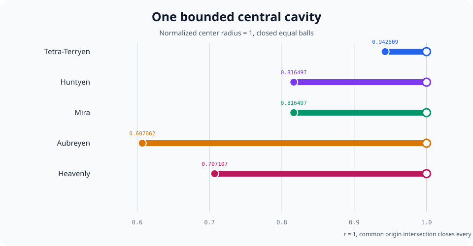
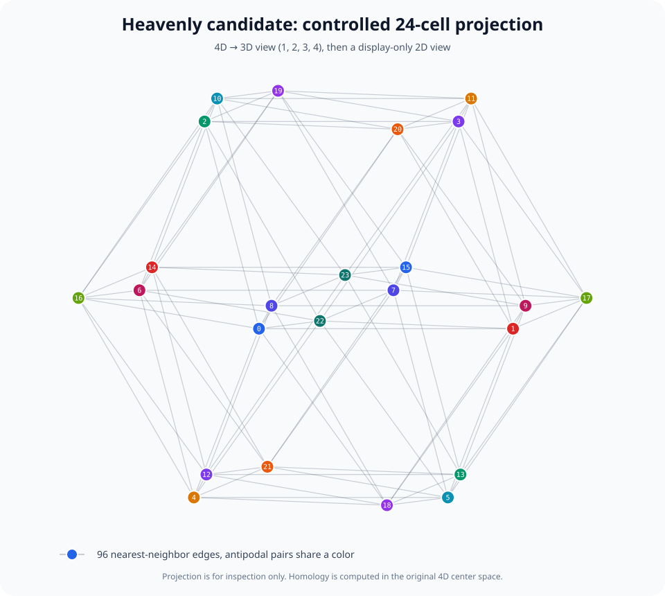

# Terryen equal-sphere negative-space audit v0.1

Status: EXPERIMENTAL candidate geometry, with exact or numerically verified
mathematics inside the stated model.

## Purpose and boundary

The Terryology source reports five Terryen Wave Field counts: 4, 8, 6, 12,
and 24. It does not supply a unique coordinate set for each picture. The engine
therefore keeps the source report separate from a testable candidate mapping:

| Source name | Reported count | Candidate center set | Ambient dimension |
| --- | ---: | --- | ---: |
| Tetra-Terryen | 4 | regular tetrahedron | 3 |
| Huntyen | 8 | cube | 3 |
| Mira | 6 | octahedron | 3 |
| Aubreyen | 12 | icosahedron | 3 |
| Heavenly | 24 | regular 24-cell, or D4 root configuration | 4 |

This audit answers a narrow question: if equal spheres are centered on those
explicit vertices, what negative space is created between them, when does a
bounded central void exist, and which mirror and projection properties survive?

It does not establish that the candidate polytopes are the unique
interpretation of the source drawings. It also does not validate a proposed
electromagnetic, particle, chemical, biological, or cosmological meaning.

## Explicit field

Every candidate center c_i is normalized so that its distance from the origin
is one. For a common sphere radius r, define the occupied union

    U_r = union_i {x in R^d : ||x - c_i||^2 <= r^2}.

Define the negative-space margin

    g_r(x) = min_i (||x - c_i||^2 - r^2).

The signs have a direct meaning:

| Value | Meaning |
| --- | --- |
| g_r(x) > 0 | x is outside every sphere, in negative space |
| g_r(x) = 0 | x is on the exposed piecewise-spherical boundary |
| g_r(x) < 0 | x is inside the occupied union |

The implementation also intersects a ray x = t u with every sphere equation
and returns the first positive hit. Within a certified central-cavity interval,
this extracts a boundary point in any requested direction without inventing a
polygon mesh.

## Why the topology calculation measures voids

A simplex enters the Cech complex exactly when the corresponding equal balls
have a nonempty common intersection. The engine obtains its critical radius
from the minimum enclosing ball of the selected centers.

Every finite intersection of Euclidean balls is convex. The Nerve Theorem
therefore gives the Cech complex and the ball union the same homotopy type.
For a compact union in R^d, Alexander duality identifies its top relevant Betti
number, beta_(d-1), with the number of bounded complement components. That is
the precise void count used here.

Boundary matrices are reduced over the two-element field. Simplices through
dimension d are sufficient to compute beta_(d-1); no visual classification is
substituted for the rank calculation.

## Central-cavity results

With unit-radius centers and closed balls, all five candidates have one
bounded central negative-space component on the following interval:

| Candidate | Cavity birth radius | Death radius | Interval |
| --- | ---: | ---: | --- |
| Tetra-Terryen | sqrt(8/9) = 0.9428090416 | 1 | [birth, 1) |
| Huntyen | sqrt(2/3) = 0.8164965809 | 1 | [birth, 1) |
| Mira | sqrt(2/3) = 0.8164965809 | 1 | [birth, 1) |
| Aubreyen | sqrt((2 - 2/sqrt(5))/3) = 0.6070619982 | 1 | [birth, 1) |
| Heavenly | 1/sqrt(2) = 0.7071067812 | 1 | [birth, 1) |

Birth occurs when the sphere patches first complete the candidate polytope's
boundary cycle. At r = 1 the origin belongs to every ball, the nerve becomes a
full simplex, and the central complement component dies.

Representative interior Betti vectors are:

| Candidate dimension | Betti vector through codimension one | Bounded voids |
| ---: | --- | ---: |
| 3 | (1, 0, 1) | 1 |
| 4 | (1, 0, 0, 1) | 1 |

Immediately before each listed birth radius, beta_(d-1) is zero. At and after
r = 1 it is also zero. Thus the reported interval is a tested topological
transition, not merely an apparent hole in a projection.

### Heavenly regression certificate

At r = 1/sqrt(2), the 24-cell Cech skeleton has:

| Quantity | Dimensions 0 through 4 |
| --- | --- |
| Simplex counts | (24, 168, 384, 360, 144) |
| Boundary ranks | (0, 23, 145, 239, 120) |
| Betti numbers through dimension 3 | (1, 0, 0, 1) |

Just below this radius, at r = 0.70, the prototype gives Betti vector
(1, 0, 23, 0). The appearance of beta_3 = 1 at 1/sqrt(2) is therefore a genuine
change of topology.

## Mirroring

The Huntyen, Mira, Aubreyen, and Heavenly candidate center sets are centrally
symmetric. For every center c, the set contains -c. Consequently:

- their equal-sphere field satisfies g_r(x) = g_r(-x);
- the central negative-space surface is paired point for point under x to -x;
- their Cech filtration is unchanged by the central mirror.

The tetrahedron alone is not centrally symmetric. Its union with its central
mirror is exactly the eight vertices of the cube after common normalization.
This makes the Tetra-Terryen to Huntyen step a literal mirror completion within
the candidate model, not only a visual resemblance.

Every candidate also has a common center radius, zero centroid, and the same
distance-shell multiplicities at each vertex. These are directly computed
symmetry diagnostics. They do not by themselves assert a physical symmetry
law.

## Controlled projection of Heavenly

Simply deleting the W coordinate merges several 24-cell vertices. The new
projection instead uses Gram-Schmidt to construct an orthonormal three-frame
perpendicular to the default 4D view direction (1, 2, 3, 4).

For the normalized 24-cell this projection:

- retains 24 distinct 3D center images;
- has orthonormality residual below 1e-12;
- is linear, so every antipodal pair projects to an exact antipodal pair;
- exposes the view direction as a parameter, making the render reproducible.

A projection is a view of the 4D object, not an equality between three and four
dimensions. Topology is calculated before projection.

## Executable record

Primary implementation:

- src/terryen_negative_space.py
- src/terryology_audit.py
- src/twenty_four_cell_bridge.py

Regression tests:

- tests/test_terryen_negative_space.py
- tests/test_terryology_audit.py
- tests/test_twenty_four_cell_bridge.py

The tests cover all five sphere families, analytic birth values, topology
before, within, and after each cavity window, radial boundary extraction,
mirror completion, central field symmetry, and the controlled 4D projection.

## References

- M. Waters, source PDF for the Terryology chapters, especially source pages
  135, 137, 139, 140, and 141:
  https://tcotlc.com/wp-content/uploads/2019/07/OTOET_PREVIEW_017_Tuesday_July_2.pdf
- H. Edelsbrunner and J. Pach, Maximum Betti Numbers of Cech Complexes,
  arXiv:2310.14801. Its introduction states both the union-of-balls nerve
  equivalence and the interpretation of beta_(d-1) as bounded complement
  components:
  https://arxiv.org/abs/2310.14801
- O. R. Musin, The Kissing Number in Four Dimensions, Annals of Mathematics
  168 (2008), proving k(4) = 24:
  https://arxiv.org/abs/math/0309430
- D. de Laat, N. Leijenhorst, and W. de Muinck Keizer, Optimality and
  Uniqueness of the D4 Root System, identifying the D4 roots with the regular
  24-cell vertices and treating their unit normalization:
  https://arxiv.org/abs/2404.18794
