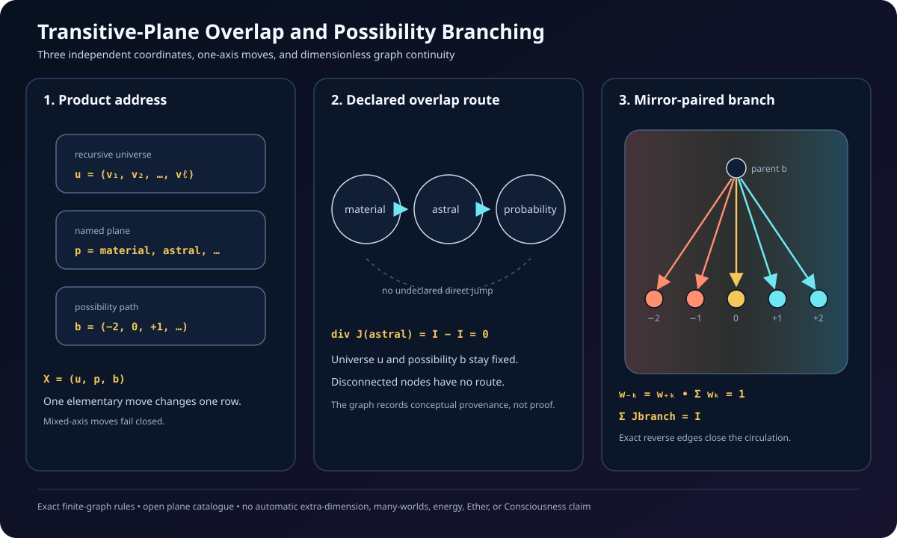

# Transitive-Plane Overlap and Possibility Branching v0.1

## Purpose

This subsystem gives Chapter 8's plane language a minimal formal topology
without treating a change of plane as a change of recursive universe scale.
It implements three independent address coordinates:

\[
X=(u,p,b),
\]

where \(u\) is a recursive Vesica-universe address, \(p\) is an open named
plane identifier, and \(b\) is a possibility path.

The book is the conceptual source for the named example graph. The graph and
its conservation identities are executable formal structures. They do not
establish that the named planes, parallel universes, or other metaphysical
interpretations are physical phenomena.

## Why this is not a seven-plane stack

Chapter 8 says that its list is incomplete and distinguishes several kinds of
relationship: overlap, transitive mediation, coexistence, and branching
possibilities. A closed list of seven vertically stacked layers would add a
constraint that the chapter does not supply.

The implementation therefore uses an open `PlaneId`. The Chapter 8 example
currently names material, mental, dream, astral, etheric, spirit, psychic, and
probability planes. More identifiers can be added without changing the address
law.

The six-plus-one pattern remains available where it is structurally relevant.
A possibility event with three mirror pairs and one neutral outcome has seven
children. That does not turn seven into a required number of planes.

## Product address and exclusive move law

An elementary transition may change exactly one coordinate:

| Relation | Universe address \(u\) | Plane \(p\) | Possibility path \(b\) |
| --- | --- | --- | --- |
| Recursive scale | adjacent parent or child | fixed | fixed |
| Plane transition | fixed | one declared overlap edge | fixed |
| Possibility branch | fixed | fixed | adjacent parent or child |

The classifier rejects a move that changes two coordinates at once. It also
rejects a scale or branch jump that skips an address depth. This is the primary
invariant that keeps the three operations distinct.

In particular, a state can move from the material plane to an overlapping
plane while remaining inside exactly the same recursive Vesica universe and
at exactly the same possibility address. Conversely, entering a child universe
does not automatically change plane or create a possibility branch.

## Plane overlap graph

A `PlaneTopology` is a finite undirected graph. Its nodes are open plane
identifiers and each edge is an explicitly declared overlap or coexistence
link. A direct transition is legal only when its two planes share an edge.
Otherwise, the shortest-route operation must find a path through declared
intermediaries. If no path exists, the transition fails.

The included `chapter_eight_overlap_topology()` records only links stated
clearly enough in the published Chapter 8 map:

- dream and probability each connect through etheric, astral, mental, and
  spirit planes;
- material connects to astral and etheric;
- etheric connects to spirit.

The psychic plane is retained as a named node but left isolated because the
chapter does not supply one of those explicit links for it. The implementation
does not invent an adjacency simply to make the graph connected.

For a routed current \(I\) along

\[
p_0\to p_1\to\cdots\to p_n,
\]

the same current is placed on each edge. Every intermediary has one incoming
and one outgoing current, hence zero divergence. Only the source and target
change content under the one-way continuity step.

## Open mirror-paired possibility address

A possibility path is a tuple of integer outcome tokens:

\[
b=(b_1,b_2,\ldots,b_d),\qquad b_i\in\mathbb Z.
\]

Zero is the neutral token. Positive and negative tokens form mirror pairs. The
local possibility mirror is

\[
M_b(b_1,\ldots,b_d)=(-b_1,\ldots,-b_d),
\qquad M_b^2=I.
\]

The global address mirror combines this sign reversal with the existing Seed
half-turn at every recursive universe depth, while preserving the plane name.
No named planes are exchanged because the source material does not define a
universal plane-pair involution.

## Conservative branch law

Let a branch have labels \(K\subset\mathbb Z\), weights \(w_k\), and
nonnegative through-current \(I\). The accepted branch law requires

\[
0\in K,
\qquad
k\in K\Longleftrightarrow-k\in K,
\]

\[
w_k\geq0,
\qquad
w_k=w_{-k},
\qquad
\sum_{k\in K}w_k=1.
\]

The outward current from parent \(b\) to child \(b+(k)\) is

\[
J_{b\to b+(k)}=I w_k.
\]

Therefore, every branch cut carries the same total current:

\[
\sum_{k\in K}J_{b\to b+(k)}=I.
\]

The one-way branch depletes the parent and distributes exactly the same total
dimensionless content among its children. The finite-graph continuity law
therefore preserves total content. Adding the exact return edge for every
child produces a closed branch circulation with zero divergence at every
node.

The helper `symmetric_possibility_branch` supports any positive number \(m\)
of mirror pairs and one neutral child. It produces \(2m+1\) outcomes. With
\(m=1\), it gives the minimal negative-neutral-positive branch. With \(m=3\),
it gives six signed outcomes plus the neutral center. Neither choice is
asserted to enumerate every real-world possibility.

## Exact failure conditions

The subsystem fails closed when:

- a move changes scale, plane, and/or possibility coordinates together;
- a scale or possibility edge skips a depth;
- a direct plane transition lacks a declared overlap;
- no intermediary route connects two planes;
- a link references a plane outside its topology;
- duplicate links or self-links are declared;
- branch labels omit neutral zero or are not closed under sign reversal;
- mirrored outcome weights differ;
- weights are negative, nonfinite, duplicated, or do not sum to one;
- a branch current is negative or nonfinite.

These are model-consistency failures. They are not empirical falsification of
the book's broader ontology.

## Evidence boundary

| Statement | Status |
| --- | --- |
| The address has three independently typed coordinates | Exact software structure |
| Every accepted elementary move changes exactly one coordinate | Exact validation rule |
| Indirect plane travel follows an explicit overlap path | Exact finite-graph rule |
| Intermediary nodes on a constant-current route have zero divergence | Exact graph identity |
| Mirror-paired branch weights preserve branch-cut current | Exact under the declared weights |
| One-way branching preserves total dimensionless content | Exact finite-graph identity |
| Adding exact return edges makes the branch locally stationary | Exact construction |
| The included overlap graph reflects selected Chapter 8 relationships | Source-derived conceptual map |
| The named planes are extra physical dimensions | Not established |
| Probability branching creates literal parallel universes | Not established |
| The graph current is physical energy, Ether, or Consciousness | Not established |
| The model predicts an observable transition rate | Not yet established |

The published source used for the conceptual map is [Chapter 8, Additional
Info on Planes](https://www.karmaticdiet.com/chapter-eight).

## Verified properties

Focused tests cover:

- independent classification of scale, plane, and possibility changes;
- rejection of mixed-axis and skipped-depth moves;
- local, global, and whole-branch mirror involutions, including neutral
  preservation and mirror/child commutation;
- direct adjacency and deterministic intermediary routing;
- failure when a named but unconnected plane has no declared route;
- fixed universe and possibility coordinates along a plane route;
- zero intermediary divergence and total-content conservation;
- three, five, seven, and eleven child branches;
- the optional six-plus-one branch without a seven-plane axiom;
- equal and custom mirror-pair weights;
- outward transfer, exact return circulation, and branch-cut flux;
- invalid topology, scalar, label, and weight inputs.

Implementation:

- `src/transitive_plane_branching.py`
- `tests/test_transitive_plane_branching.py`

## Next creator question

The plane and possibility relations are now distinct from spatial Tree routes
and recursive scale edges. The next gate is:

> What is the minimal three-dimensional vector-field lift whose planar
> cross-section reproduces the Vesica and Tree circulation, which boundary
> conditions make it divergence-free, and which observable could distinguish
> that field from a purely diagrammatic embedding?

That lift must preserve the product-address distinctions introduced here. It
must also declare units, boundary conditions, singularity handling, and a
falsification test before receiving a physical torus, wormhole, or cosmology
interpretation.

**Refinement:** before that field lift, the creator required the Sri Yantra to
be expanded beyond a planar reading. The resulting embedding-independent fibre
and its plane, spherical, Meru, simplex, and spiral-cone realizations are
documented in `docs/sri_yantra_multidimensional_v0.1.md`. The vector-field
question remains open after an exact cross-realization incidence audit.
