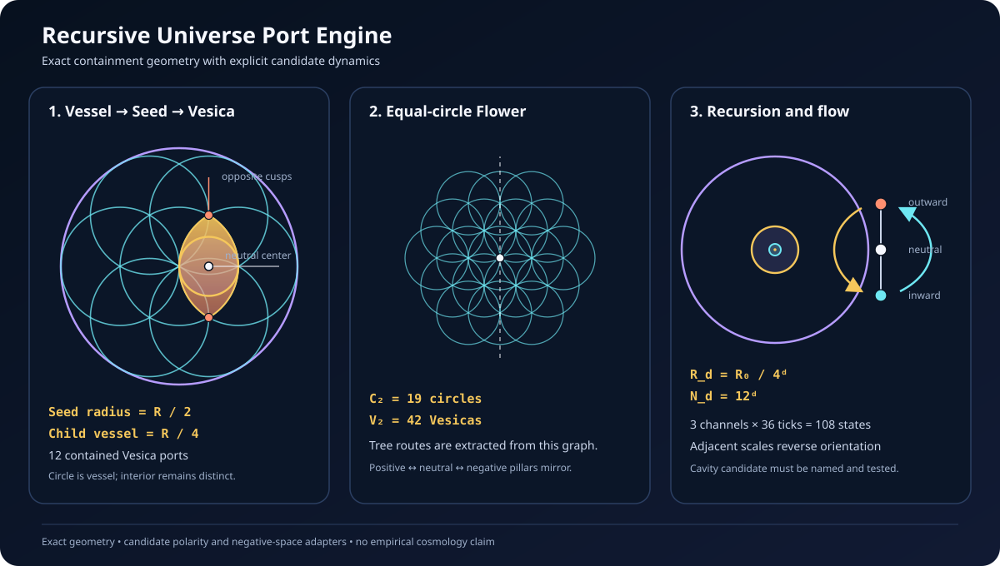

# Recursive Universe Port Engine v0.1

## Purpose

This subsystem turns the book's circle, Seed, Vesica, Flower, and inner/outer
Tree map into one executable geometry. It also attaches the existing canonical
polarity clock, 108-state routing, alternating scale orientation, and Terryen
negative-space diagnostics without presenting those adapters as established
cosmology.

The governing distinction is:

- the circle is a vessel or shell;
- its interior is a distinct domain;
- a Vesica is an interface made by two neighboring circles;
- every Vesica lens is an addressed universe domain and interface;
- an equal-circle Flower expands outward;
- contained universe recursion contracts inward.

## Contained Seed construction

Let a parent vessel have center (C) and radius (R). The contained Seed uses
seven circles of radius

$
r_s=\frac{R}{2}.
$

One Seed circle is centered at (C). The other six centers lie on a regular
hexagonal ring of radius (r_s). Every Seed circle is therefore contained in
the parent vessel, with each outer circle internally tangent to its shell.

The local Seed contains twelve neighboring circle pairs:

- six center-to-ring pairs;
- six adjacent-ring pairs.

Those are the same twelve indexed Vesicas already used by
`VesicaUniverseAddress`.

## Exact Vesica geometry

For two equal Seed circles with radius (r_s) and center separation (r_s),
the Vesica has:

$
L_{\mathrm{minor}}=r_s,
\qquad
L_{\mathrm{major}}=\sqrt{3}\,r_s,
$

and lens area

$
A_{\mathrm{lens}}
=
\left(
\frac{2\pi}{3}-\frac{\sqrt{3}}{2}
\right)r_s^2.
$

The midpoint between the two circle centers is the neutral center of the
port. The two circle-intersection points are the opposite cusp or funnel
points.

The largest circle centered at the neutral point and contained in the Vesica
has radius

$
r_u=\frac{r_s}{2}.
$

This circle is the internal vessel that carries the next complete Seed. It does
not replace the Vesica lens as the addressed universe domain. Because
(r_s=R/2), its radius is

$
R_{d+1}=\frac{R_d}{4}.
$

This resolves an important scale ambiguity. A Vesica's centered child circle
is half the radius of its two generating circles, but the generating circles
are themselves half the radius of their containing universe vessel. The full
contained recursion therefore uses one quarter, not one half, per universe
depth.

At depth (d),

$
R_d=\frac{R_0}{4^d},
\qquad
N_d=12^d,
$

where (R_d) is the internal recursion-vessel radius and (N_d) is the number
of distinct Vesica addresses at exactly that depth. The software imposes no
arbitrary maximum depth. Finite precision and available computation remain
practical limits.

This ratio is an exact consequence of the selected planar containment
convention. It is not a derived physical ratio between observed universes.

## Flower expansion and Tree extraction

Outward Flower growth is deliberately separate from inward containment. A
Flower of radius (n) is the hexagonal disk

$
\max(|q|,|r|,|q+r|)\le n
$

on an axial lattice whose neighboring circle centers are one circle radius
apart. It contains

$
C_n=1+3n(n+1)
$

equal circles and

$
V_n=9n^2+3n
$

neighboring Vesica interfaces. Thus:

| Form | Ring radius | Circles | Vesicas |
| --- | ---: | ---: | ---: |
| Single circle | 0 | 1 | 0 |
| Seed | 1 | 7 | 12 |
| Nineteen-circle Flower | 2 | 19 | 42 |

The Tree is extracted from this Flower graph rather than imported as an
unrelated diagram.

- Outer Tree routes point from smaller hexagonal radius to larger radius.
- Inner Tree routes reverse every radial route.
- Same-radius edges remain transverse weave links.
- The sign of (2q+r) gives the negative, neutral, and positive pillars.

Central mirroring sends ((q,r)) to ((-q,-r)). It exchanges the positive and
negative pillars, preserves the neutral pillar, and changes every outer route
into its inward reciprocal.

## Active port state

The dynamic adapter uses the existing 36-tick polarity clock. For parent depth
(ell),

$
\epsilon_\ell=(-1)^\ell,
\qquad
\phi_t=\frac{\pi t}{18},
$

$
p_\ell(t)=\epsilon_\ell\cos\phi_t,
\qquad
s_\ell(t)=\epsilon_\ell\sin\phi_t.
$

The first carrier marks outward, neutral, or inward polarity. The quadrature
carrier marks transfer into the child, balance, or transfer into the parent.
Adjacent depths reverse both carriers.

Each state also takes one explicit routing channel (c\in\{0,1,2\}). The
three channels and 36 clock positions cover all 108 core states exactly. Its
paired state is the canonical polarity partner (T_{54}(n)).

At nonneutral polarity, the two ordered Vesica cusps provide a computational
source and sink direction. This ordering is a local frame convention. It is
not evidence that either mathematical point is a physical black hole or white
hole.

## Negative-space aperture

The previous Terryen analysis supplies five explicit equal-sphere candidate
families. The engine does not silently choose one of them. A caller must name
the candidate and its normalized sphere radius.

A candidate aperture is open only when both conditions hold:

1. the radius lies in that candidate's analytically recorded central-cavity
   window;
2. the Cech-nerve calculation finds exactly one bounded complementary
   component.

This makes negative space operational in software while preserving the
uncertainty among tetra-Terryen, Huntyen, Mira, Aubreyen, and Heavenly.

## Mirroring invariants

At every recursive depth, the engine verifies:

$
M(M(a))=a,
$

$
C(M(a))=2C_0-C(a),
$

and preserves the child radius. The neutral center, both ordered cusp points,
and the complete recursive domain mirror through the root center. Scale parity
then reverses the dynamic carriers between adjacent depths.

## Conservative circulation extension

`src/vesica_tree_circulation.py` now supplies a dimensionless graph-content
continuity law on this geometry. The local Vesica current passes through both
cusps and the neutral center, then closes over two separately labeled return
channels. On the Flower graph, normalized outer flow has equal total flux
across every radial cut, the inner Tree is its exact weighted reverse, and
same-ring weaves are closed cycles.

Recursive scale current is represented by a different parent-child address
edge. This prevents a radial Tree route from being mistaken for inward or
outward universe recursion. Transitive-plane branching remains a third,
unimplemented relation.

The full law, diagram, tests, and evidence boundary are in
`docs/vesica_tree_circulation_v0.1.md`.

## Evidence boundary

| Layer | Current status |
| --- | --- |
| Circle, contained Seed, Vesica dimensions and area | Exact Euclidean geometry |
| Flower counts, adjacency, mirror, inner/outer Tree reversal | Exact finite graph geometry |
| Recursive addresses and one-quarter containment law | Exact under the declared planar convention |
| Vesica and Tree continuity identities | Exact under the declared finite-channel graph |
| Plane/possibility/scale address separation | Exact software validation rule |
| Mirror-paired possibility-branch flux | Exact under the declared finite-graph weights |
| 36-tick carrier and 108-state pairing | Exact software coupling to the canonical finite engine |
| Terryen cavity aperture | Model-derived topology for explicit candidate center sets |
| Elemental, Consciousness/Ether, DNA, eye, torus, black/white-hole meanings | Interpretive hypotheses |
| A literal physical Omniverse or new law of gravity | Not established |

## Verified properties

The focused tests establish:

- all seven Seed circles remain inside the parent vessel;
- all twelve child universe circles lie inside their Vesicas and parent;
- recursive radius follows (R_0/4^d);
- address count follows (12^d);
- recursive mirroring is involutive in address and physical coordinates;
- Flower circle and Vesica counts match their closed forms;
- inner and outer Tree routes are exact reverses;
- the cusp-neutral Vesica loop is divergence-free;
- normalized Tree current preserves flux across every radial cut;
- the matched inner/outer flow and ring weave are divergence-free;
- plane transitions preserve recursive scale and follow declared overlap
  edges;
- possibility branches preserve recursive scale and named plane while
  extending a separate signed branch address;
- mixed scale, plane, and possibility changes fail closed;
- three pillars transform correctly under the central mirror;
- every explicit Terryen candidate opens exactly one bounded cavity within its
  certified window;
- quarter-cycle polarity and scale-transfer states occur at ticks 0, 9, 18,
  27, and 36 as specified;
- three routing channels across 36 ticks cover all 108 core states.

## Next research gate

Chapter 8's transitive-plane relation is now implemented separately in
`src/transitive_plane_branching.py`. It gives scale, plane, and possibility
their own address coordinates, explicit overlap routes, mirror semantics, and
a dimensionless branch-continuity law.

The next extension is a three-dimensional toroidal lift that tests whether the
planar circulation can be the cross-section of a coherent vector field. It
must state units, boundary conditions, singularity handling, and an observable
that distinguishes the field from a diagrammatic embedding. It must not
replace the Flower substrate or be identified with physical cosmology without
data.
