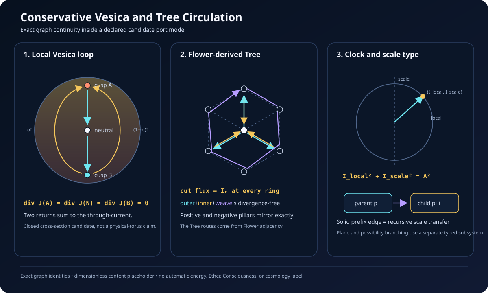

# Conservative Vesica and Tree Circulation v0.1

## Purpose

This subsystem gives the recursive universe-port geometry a minimal local
continuity law. It answers a narrow creator question: what can circulate
through the two Vesica cusps, the neutral center, and the Flower-derived inner
and outer Tree without being created or destroyed at an internal node?

The conserved variable is deliberately called **content**. It is a
dimensionless scalar placeholder. The implementation does not identify it with
energy, electric charge, information, Consciousness, Ether, matter, or any
other measured quantity.

## Discrete continuity law

Let $q_a$ be the content at graph node $a$. For a signed current
$J_{a\to b}$ on each directed edge, the adopted divergence is

$$
(\operatorname{div}J)_a
=
\sum_{a\to b}J_{a\to b}
-
\sum_{c\to a}J_{c\to a}.
$$

The local continuity equation is

$$
\frac{dq_a}{dt}+(\operatorname{div}J)_a=0.
$$

The explicit diagnostic step is

$$
q_a^{n+1}
=
q_a^n-\Delta t\,(\operatorname{div}J)_a.
$$

Every internal edge contributes once with each sign. Therefore, on a closed
finite graph,

$$
\sum_a(\operatorname{div}J)_a=0
\quad\Longrightarrow\quad
\sum_a q_a^{n+1}=\sum_a q_a^n.
$$

This is an exact graph identity up to floating-point arithmetic. A current is
locally stationary when its divergence vanishes at every node.

## Vesica cross-section

The minimal port graph has three nodes:

- cusp \$A\$;
- neutral center \$N\$;
- cusp \$B\$.

For through-current $I$ and return split $0\leq\alpha\leq1$, its four
channels are

$$
A\to N:I,
\qquad
N\to B:I,
$$

$$
B\to A:\alpha I,
\qquad
B\to A:(1-\alpha)I.
$$

The two return edges have distinct upper and lower channel identities even
though they join the same graph nodes. Their sum is $I$, so

$$
\operatorname{div}J(A)
=
\operatorname{div}J(N)
=
\operatorname{div}J(B)
=0.
$$

Negative $I$ reverses the effective circulation without changing the stored
edge topology. The mirror-symmetric default is $\alpha=1/2$; unequal splits
remain conservative but introduce an explicit return-channel asymmetry.

This loop is a minimal **toroidal cross-section candidate**. A closed planar
current diagram is not proof of a three-dimensional torus or a physical field.

## Flower-derived Tree circulation

The Tree uses the exact Flower adjacency graph already supplied by
`tree_from_flower`. Unit outward flow begins at the center. At each interior
node, all received flow is divided equally among that node's outward routes.
When multiple routes meet a node, their contributions are accumulated before
the next ring is processed.

If $w_{uv}$ is the resulting weight on outward edge $u\to v$, then every
radial cut carries unit flux:

$$
\sum_{u\in R_d,\,v\in R_{d+1}}w_{uv}=1
\qquad
0\leq d<n.
$$

For radial current $I_r$, the outer Tree carries $I_r w_{uv}$. The inner
Tree places the same weighted current on the exact reverse edge. The pair
therefore cancels node by node. Every same-radius Flower ring may additionally
carry a closed weave current $I_w$ with either handedness. A ring cycle also
has zero divergence at every node.

Consequently,

$$
\operatorname{div}
\left(
J_{\mathrm{outer}}+J_{\mathrm{inner}}+J_{\mathrm{weave}}
\right)
=0.
$$

Central mirroring preserves the normalized route weights, exchanges the
positive and negative pillars, and preserves the neutral pillar. It therefore
forces equal positive- and negative-pillar boundary flux. It does not require
all three pillar fluxes to be equal.

## Recursive scale current is a different relation

Spatial Tree routing and recursive scale transfer are intentionally different
types.

A scale edge may join only a parent address $p$ to a child address
$p\mathbin{+}(i)$. The child must extend the parent path by exactly one valid
Vesica index. Positive current points into the child and negative current
points into the parent.

This prefix relation is not:

- a radial edge in the Flower;
- an inner or outer Tree route;
- a same-ring weave route;
- a transitive-plane branch.

That last relation is now implemented in `src/transitive_plane_branching.py`
with its own named-plane and possibility coordinates. It preserves the
recursive universe address, so it cannot silently become a scale edge.

## Canonical clock coupling

For amplitude $A\geq0$, parent depth $\ell$, and clock phase
$\phi_t=\pi t/18$, the candidate adapter uses

$$
I_{\mathrm{local}}
=
A(-1)^\ell\cos\phi_t,
\qquad
I_{\mathrm{scale}}
=
A(-1)^\ell\sin\phi_t.
$$

Thus,

$$
I_{\mathrm{local}}^2+I_{\mathrm{scale}}^2=A^2.
$$

At ticks $0,9,18,27,36$, the adapter cycles through maximum local outward
circulation, maximum transfer into the child, maximum local inward
circulation, maximum transfer into the parent, and back to the initial state.
Adjacent recursive depths reverse both signed carriers.

There are two separate invariants here:

1. the continuity invariant $\sum_a q_a$ on a closed graph;
2. the clock-carrier norm $I_{\mathrm{local}}^2+I_{\mathrm{scale}}^2$.

The second does not, by itself, prove that the currents are physical energy or
that the clock dynamically generates them.

## Evidence boundary

| Statement | Status |
| --- | --- |
| Internal-edge divergence sums to zero | Exact finite-graph identity |
| Vesica four-channel loop is locally divergence-free | Exact under the declared channel graph |
| Normalized outer Tree has equal total flux across every radial cut | Exact algorithmic result |
| Inner Tree exactly reverses outer Tree; ring weaves are closed | Exact finite-graph construction |
| Positive and negative pillar boundary fluxes match under the central mirror | Exact under the declared Flower mirror |
| Clock carriers preserve their squared quadrature norm | Exact consequence of sine and cosine |
| Content is energy, charge, Ether, Consciousness, or matter | Not established |
| The planar loop is a physical torus, wormhole, or black/white-hole flow | Not established |
| A measured system follows the port clock or one-quarter scale law | Not established |

## Verified properties

The focused tests cover:

- local balance for positive, negative, zero, symmetric, and asymmetric Vesica
  currents;
- content transfer and total conservation for a nonstationary graph state;
- zero continuity residual for the explicit update law;
- clock quadrature at all 36 ticks across four recursive depths, including the
  cardinal phase positions;
- adjacent-depth reversal and parent/child address validation;
- unit normalized flux across every Tree ring cut for one through five rings;
- exact weighted reversal of outer and inner Tree edges;
- closed ring cycles in both handednesses;
- global node balance with simultaneous radial and weave currents;
- mirror-related Tree weights and pillar fluxes;
- fail-closed behavior for invalid topology, time steps, amplitudes, and splits.

Implementation:

- `src/vesica_tree_circulation.py`
- `tests/test_vesica_tree_circulation.py`

## Next creator question

The plane and possibility address relation is now specified in
`docs/transitive_plane_branching_v0.1.md`. The next question is:

> What is the minimal three-dimensional vector-field lift whose planar
> cross-section reproduces the Vesica and Tree circulation, which boundary
> conditions make it divergence-free, and which observable could distinguish
> that field from a purely diagrammatic embedding?

The lift must preserve the separation between spatial Tree routing, recursive
scale transfer, plane overlap, and possibility branching.
