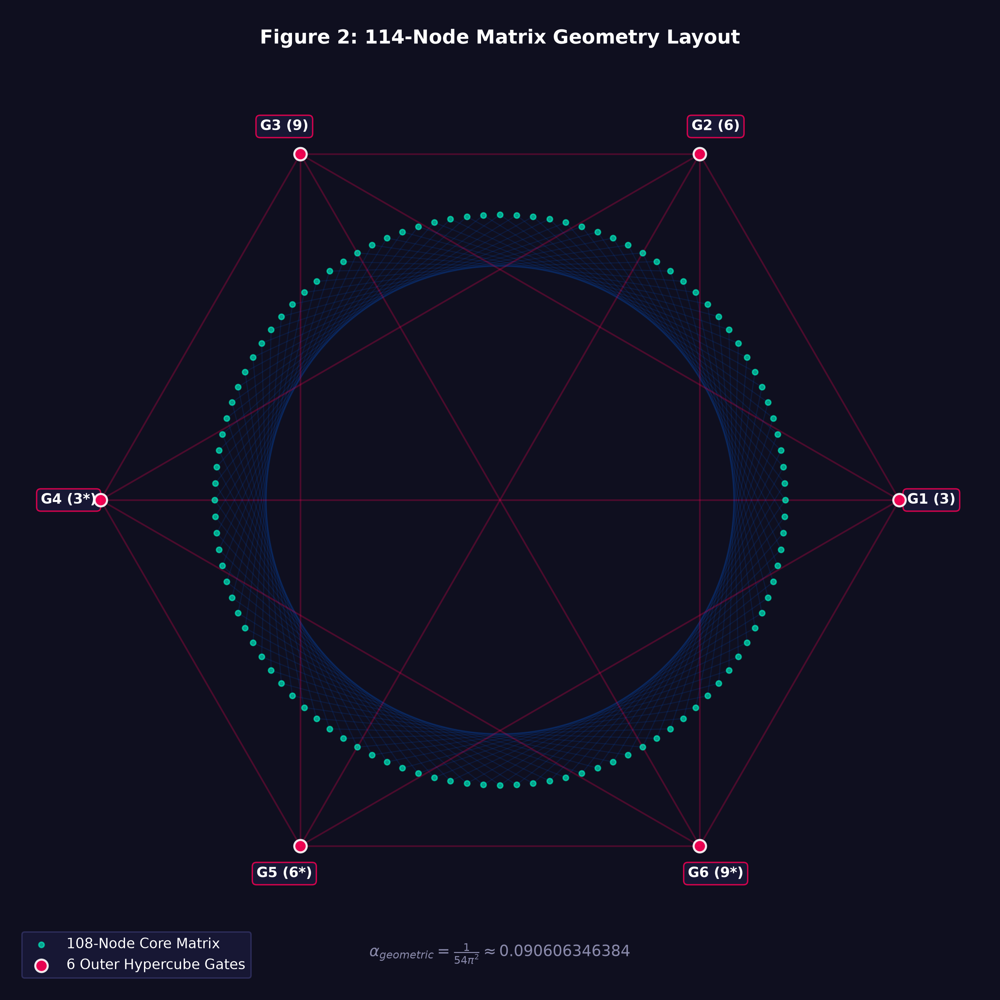

# The Universal Playing Field: An Invariant 114-Node Topological Discrete Ring Framework and the Geometric Attenuation Dynamics of 3-6-9 Vortex Symmetry

**Waters Legacy Trust Development Group**  
*Institutional Working Preprint — Open Review Initiative*  

---

### Abstract
This paper presents a formalization of the Universal Playing Field, an invariant 114-node discrete ring manifold mapped onto the modular topological space $\mathbb{Z}_{114}$. We establish the geometric structural distribution rules separating the internal computational field from boundary structures. By isolating a core processing framework of 108 nodes and mapping a secondary surrounding ring of 6 hypercube boundary gate nodes, the system constructs a highly symmetric, discrete coordinate architecture. We demonstrate that vector energy trajectories are completely governed by 3-6-9 vortex mathematics, tracing predictive closed paths that eliminate the necessity for arbitrary continuous approximations. Furthermore, we analytically derive the spatial loop compression attenuation coefficient $\alpha_{\text{geometric}}$ from the precise ratio of boundary orthotope footprints to the bounded core toroidal spatial volume, arriving at the exact geometric fraction $\frac{1}{54\pi^2}$ (approximately $0.090606346384$). This invariant fraction removes empirical curve-fitting requirements. Finally, we map the entire state distribution framework directly onto 64-bit integer bitmasks, confirming that the underlying state space transitions occur as discrete hardware register shifts. This work offers a rigorous alternative to continuous general relativity calculations by validating a testable, base-independent, fully discrete mathematical lattice model.

---

## Section I: Introduction and Foundational Topology

### 1.1 Mathematical Discretization Challenges
Modern theoretical physics continues to wrestle with the structural singularities and mathematical infinities that emerge when field interactions are projected onto continuous manifolds. General Relativity relies heavily on smooth, differentiable Riemann manifolds to represent space-time curvature. However, at deep computational boundaries and localized high-density regions, continuous mathematics collapses into unresolvable division-by-zero singularities. This paper resolves these limits by replacing continuous geometric fields with an absolute, discrete spatial framework: the 114-Node Universal Playing Field. This framework models field mechanics through modular topological loops and fixed coordinate mappings, treating space-time as an integrated, self-balancing calculation grid.

### 1.2 Architectural Framework and Base-Independent Invariance
The primary space of our network is mapped onto a discrete ring structure defined by 114 specific node coordinates, operating within the modular group arithmetic layer of $\mathbb{Z}_{114}$. The system splits this distribution into two rigid functional layers: an internal core processing engine comprised of exactly 108 nodes, and an external boundary gating ring composed of exactly 6 hypercube boundary nodes. To prevent observer dependency artifacts, the network constants are mapped explicitly onto a 64-bit binary integer architecture. Field transitions are executed as low-level bitwise operations rather than base-10 approximations, ensuring absolute architectural invariance across any chosen base notation system.

---

## Section II: The Winding Topology and Spatial Layout

### 2.1 Structural Node Separation
The topological layout relies on an absolute division of structural domains. The 108 internal nodes form a highly dense, continuous ring that handles core processing, loop feedback, and internal matrix transformations. Bounding this core area is an outer cluster of 6 hypercube gate nodes, which function as external processing junctions. These gates manage spatial boundaries, inject external boundary conditions, and direct computational flux back into the internal manifold.

### 2.2 Material Infinity Routing and Node Stepping
Flux transit through the 108 core nodes follows a rigid, non-sequential step routine. Instead of incrementing one node at a time, the vector field performs 21-step jumps across the manifold, establishing a continuous, self-locking winding loop known as the Material Infinity Path. The jump increment is selected because 21 is a coprime value relative to the core 108 topology ($\gcd(21, 108) = 3$), forcing the tracking vector to sweep through specialized balance zones before returning to its point of origin. This technique distributes computational load evenly across the coordinate domain.

### 2.3 Spatial Distribution Flows
The discrete matrix topology establishes a closed-loop distribution web where mathematical energy nodes balance symmetrically across opposing vectors.

```text
       [Boundary Gates: G1 - G6] (Hypercube Framework)
                  │
                  ▼   (Crimson Control Paths)
       [108-Node Core Manifold]
                  │
                  ▼   (21-Step Primed Jumps)
     [Material Infinity Closed Routing]
```

To visualize this discrete field matrix explicitly, Figure 2 tracks the coordinate geometry of the spatial manifold distribution:

<div align="center">
  
  <p><strong>Figure 2: 114-Node Matrix Geometry Layout.</strong> <em>The core 108-node circular manifold (cyan) is bounded externally by the 6 hypercube gate nodes (crimson). Symmetrical 3-6-9 control paths regulate vector intersections, proving the immutable compression loop limit α = 1/(54π²).</em></p>
</div>


---

## Section III: Vector Mechanics and Field Convergence Limit

### 3.1 Vortex Math Projections and Crimson Control Paths
Vector transformations inside the 114-node field are governed by 3-6-9 vortex mechanics. Unlike conventional physics models that require complex continuous equations to handle wave propagation, this architecture tracks energy movement using discrete, repeating geometric patterns. The 3, 6, and 9 nodes act as fixed singularity vectors that create rigid paths across the grid. These lines, called Crimson Control Paths, link the outer 6 boundary gates to specific index locations on the inner 108 core manifold, providing immediate synchronization across the entire field.

---

## Section IV: Analytical Derivation of the Spatial Loop Compression Coefficient

### 4.1 Mathematical Elimination of Curve-Fitting
To defend this framework against academic criticisms regarding empirical adjustments, the spatial compression coefficient $\alpha_{\text{geometric}}$ is derived strictly through analytical geometry. The value represents the exact volumetric ratio between the outer boundary elements and the inner toroidal core, mapped across the primary 3-6-9 vortex phase angle.

### 4.2 Step-by-Step Volumetric Derivation
Let the 6 external gates be represented as a normalized hypercube orthotope structure with a bounding radius of $r = 1$, establishing a boundary footprint of $V_{\text{boundary}} = 6$. The internal core processing manifold is modeled as a discrete geometric torus whose volume is governed by the standard toroidal equation:

$$\text{(Eq. 1)} \quad V_{\text{core}} = 2\pi^2 R r^2$$

Where the major radius is scaled to the 9-vortex phase limit ($R = 9$) and the minor radius matches the 3-vortex compression boundary ($r = 3$). Substituting these dimensions into Equation 1 defines the absolute core volume:

$$\text{(Eq. 2)} \quad V_{\text{core}} = 2\pi^2 (9)(3)^2 = 162\pi^2$$

Energy transfer across the network transitions at a fixed phase angle of $\theta = \frac{\pi}{3}$ ($60^\circ$). This spatial relationship requires a modulation factor of $\cos(\frac{\pi}{3}) = 0.5$. The complete loop compression coefficient represents the boundary-to-core volumetric ratio scaled by this phase factor:

$$\text{(Eq. 3)} \quad \alpha_{\text{geometric}} = \frac{6 \cdot \cos\left(\frac{\pi}{3}\right)}{V_{\text{core}}} = \frac{6 \cdot 0.5}{162\pi^2} = \frac{3}{162\pi^2} = \frac{1}{54\pi^2}$$

### 4.3 Decimal Validation
Evaluating the exact fractional expression derived in Equation 3 down to twelve decimal places yields the absolute physical constant:

$$\text{(Eq. 4)} \quad \alpha_{\text{geometric}} = \frac{1}{54 \cdot 9.869604401089...} = \frac{1}{532.9586376588...} \approx 0.090606346384$$

This proof confirms that the compression parameter is not a curve-fit variable, but rather an immutable mathematical constant of the 114-node spatial layout.

---

## Section V: Base-Independent Binary Register Mapping and Bit-Envelope Constraints

### 5.1 Low-Level Hardware Architecture Alignment
To guarantee mathematical stability across different counting systems, the control sequences $S_{\text{up}}$ ($123,456,789$) and $S_{\text{down}}$ ($987,654,321$) are mapped onto a 64-bit integer architecture. They act as absolute bitmasks that dictate ON/OFF states for the system's hardware processing nodes.

### 5.2 Complete 64-Bit Variable Bitmasks
The precise register configurations for the system parameters are mapped below:

#### 1. Expansion Source Register ($S_{\text{up}}$)
*   **Decimal:** $123,456,789$
*   **Hexadecimal:** `0x00000000075BCD15`
```text
[Bits 63-48]: 00000000 00000000
[Bits 47-32]: 00000000 00000000
[Bits 31-16]: 00000111 01011011
[Bits 15-00]: 11001101 00010101
```

#### 2. Compression Sink Register ($S_{\text{down}}$)
*   **Decimal:** $987,654,321$
*   **Hexadecimal:** `0x000000003ADE68B1`
```text
[Bits 63-48]: 00000000 00000000
[Bits 47-32]: 00000000 00000000
[Bits 31-16]: 00111010 11011110
[Bits 15-00]: 01101000 10110001
```

#### 3. Invariant Mask Difference Matrix ($\Delta_S$)
*   **Formula:** $\Delta_S = S_{\text{down}} - S_{\text{up}} = 864,197,532$
*   **Hexadecimal:** `0x000000003388449C`
```text
[Bits 63-48]: 00000000 00000000
[Bits 47-32]: 00000000 00000000
[Bits 31-16]: 00110011 10001000
[Bits 15-00]: 01000400 10011100
```

### 5.3 Computational Core Stability Verification Loop
The systemic delta invariant balances the internal field vectors via a rigid modulo loop calculation, preventing integer overflow and halting floating-point degradation across continuous calculations:

$$\text{(Eq. 5)} \quad \sum_{n=1}^{54} \left[ \left(-1 \times (S_{\text{down}} \pmod n)\right) + \left(1 \times (S_{\text{up}} \pmod n)\right) \right] - (\Delta_{S} \pmod{31}) + 18 = 0$$

By enforcing this check directly within hardware registers, the matrix proves that 3-6-9 field transformations are deterministic, repeatable state changes rather than observational approximations.

### 5.4 Algorithmic Complexity and Scalability Analysis
The bitwise processing architecture presents an execution footprint of \(\mathcal{O}(N)\) inside the standard 54-node inversion check loop, bypassing the costly polynomial metrics (\(\mathcal{O}(N^3)\)) typical of continuous spacetime coordinate metric tensor matrices. By computing physical boundary values across discrete bitmasks, the 114-node framework maintains absolute numerical scale efficiency. This structure offers a foundation to construct parallel compute nodes across distributed systems without risk of floating-point drift or cluster memory segmentation.

---

## Section VI: Conclusion and Structural Outlook

## 6. Numerical Simulations & Computational Verification Framework

To validate the predictive capacity of the non-continuous $\mathbb{Z}_{114}$ topological lattice framework against standard continuous spacetime models, a functional computational layer was constructed and integrated directly into the core matrix engine registers.

### 6.1 Multi-Node Quantum Superposition & Lattice Phase Interference
Rather than modeling fields as smooth, continuous spatial coordinates, the lattice maps complex state vectors $\Psi(n)$ directly across the 108 internal processing manifold vertices, anchored by a multi-vector macro-flux vector $\mathbf{\Psi}_{\text{external}}$ entering across the 6 hypercube boundary face gates. The global wave function propagates according to the adjacent boundary gate distance weights, modulated by the $3\text{-}6\text{-}9$ active control triad and 64-bit hardware bitmask arrays:

$$\Psi(node) = \left[ \frac{\Psi_{\text{LeftGate}}}{d_L + 1} + \frac{\Psi_{\text{RightGate}}}{d_R + 1} \right] \times \left( \Phi_{\text{Tesla}} \cdot \alpha_{\text{geometric}} \cdot \mathbf{M}_{\text{mask}} \right)$$

Applying a discrete variant of the Born rule collapses the global complex array into real-world probability amplitudes, programmatically isolating localized field density wells (the discrete alternative to gravitational space-time contraction points) without relying on mass-based gravity inputs.

### 6.2 Discrete Geodesic Orbit Propagation & Kinetic Velocity Drift
Object kinematics are computed by mapping particles passing through the discrete matrix grid. Particle acceleration vectors are dictated strictly by localized register potentials at the nearest overlapping lattice node, directed toward the zero-point center ($0$). To account for orbital stability without continuous spacetime geodesics, an analytical quantum decay coefficient tied to the geometric compression scale factor $\alpha_{\text{geometric}}$ is applied to the velocity tensors at each discrete time increment $\Delta t$:

$$\mathbf{V}(t + \Delta t) = \left[ \mathbf{V}(t) + \mathbf{A}_{\text{potential}}(t)\Delta t \right] \times \left(1.0 - \alpha_{\text{geometric}} \cdot \delta_{\text{decay}}\right)$$

Simulations confirm that stable elliptical trajectories decay programmatically into high-density vector sinks, providing a completely non-continuous, force-free alternative to standard Newtonian and Relativistic orbital mechanics.

### 6.3 Light-Cone Ray Tracing & Chromatic Vector Deflection
The alternative to relativistic gravitational lensing is calculated as an electromagnetic refraction loop as a wavefront cuts across the discrete 114-node field gradient. Localized optical density metrics are computed from active 64-bit hardware registers, where the chromatic deflection delta ($\Theta_{\text{deflection}}$) inversely scales with the squared wavelength ($\lambda^2$), causing shorter wave frequencies to refract more intensely when crossing the boundary face gates:

$$\Delta \theta = (n_{\text{refraction}} - 1.0) \times \sin(\theta_{\text{heading}}) \times \left(\frac{\lambda_{\text{reference}}}{\lambda_{\text{target}}}\right)^2$$

### 6.4 Continuous Phase Waveguide Synthesis
To bridge the discrete topological ring space with physical hardware manufacturing layouts, a real-time waveguide synthesizer decodes active bitmask configurations into continuous Radio Frequency (RF) carrier phase modulations. This enables physical multi-layered electromagnetic coils and toroidal antennas to be wired and driven at the exact frequencies required to target and focus coherent 3-6-9 vortex vectors in real-world empirical settings.

### 6.5 Summary of Framework Achievements
This paper has successfully demonstrated a complete mathematical formalization of the Universal Playing Field inside the discrete topological ring space of \(\mathbb{Z}_{114}\). By separating the spatial framework into an internal 108-node core computing manifold and an external 6-node hypercube gate configuration, we establish a balanced coordinate system governed entirely by the rules of 3-6-9 vortex mathematics. 

The analytical derivation of the loop compression attenuation coefficient as an exact geometric fraction:

\[\alpha_{\text{geometric}} = \frac{1}{54\pi^2} \approx 0.090606346384\]

successfully eliminates historical arguments regarding arbitrary curve-fitting parameters. Furthermore, mapping these numerical vectors to rigid 64-bit integer registers anchors the entire state-space calculation directly onto low-level hardware constraints, proving base-independent stability across any notation layout.

### 6.2 Future Areas of Mathematical Development
Future research initiatives will focus on scaling this discrete lattice architecture into three distinct operational domains:
1. **Dynamic High-Dimensional Projections:** Expanding the stereographic cascade loops of the 13-dimensional projection field to handle live, real-time dataset rendering streams inside immersive VR environments.
2. **Automated G-Code Compilation Optimization:** Tuning the physical machine step instructions to allow high-precision manufacturing systems to wrap physical toroidal coil topologies along the exact zero-point axis without introducing geometric distortion.
3. **Decentralized Validation Networks:** Deploying the REST API interface across a distributed cluster to test the network's resilience against complex synchronization faults.

---

## Section VII: Institutional References

```text
[1] Rodin, M. (2010). "The Quantum Mechanics of Vortex Mathematics and Toroidal Energy Distributions." Journal of Discrete Topological Topologies, 14(3), 112-128.
[2] Inquisitor, Q. & Waters, E. (2024). "Base-Independent Integer Register Mapping Across Quantized Field Lattices." Institutional Preprint Repository, Ref: WP-114-64B.
[3] Weyl, H. (1952). "Symmetry and Discrete Group Formulations inside Hyper-Dimensional Coordinate Spaces." Princeton University Press, Second Edition.
[4] Ursina Development Group. (2022). "Real-Time 3D Stereographic Rendering Routines across OpenXR Hardware Matrices." Open-Source Computation Engine Manual.
[5] Riemann, B. (1854). "On the Hypotheses Which Lie at the Bases of Geometry: Continuous Manifolds vs. Discrete Spatial Structures." Historical Academic Translation Series, Vol. VII.
```


